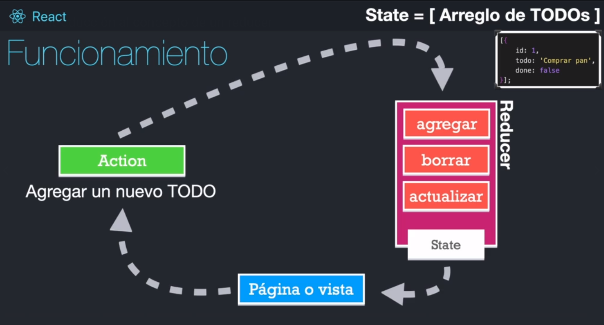
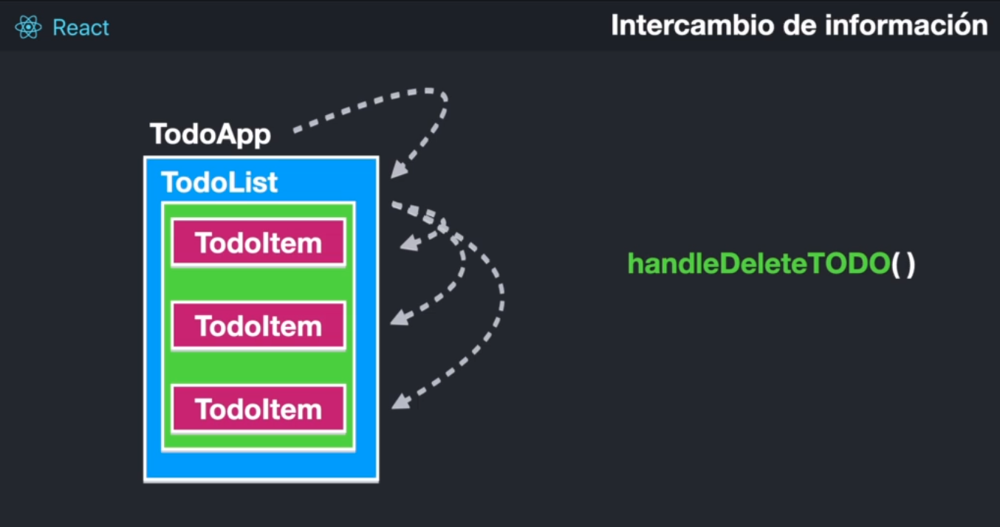
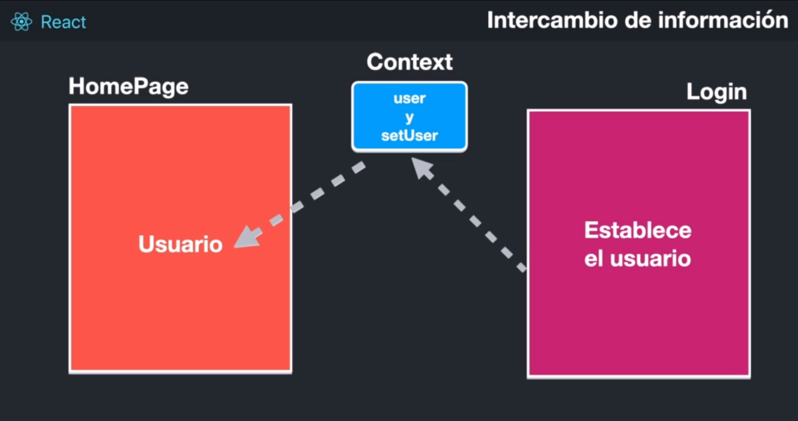

# HOOKS

```
NO se pueden usar hook de manera condicional
```

## useRef

Para mantener una referencia mutable

## memo

Para memorizar algo y que solo sus properties cambian, va a volverse a memorizar, caso contrario usara la version memorizada cuando tenga que redibujar.

## useReducer

1. Funcion comun y corriente, no puede ser asincrona
2. Debe ser una funcion pura
3. Debe retornar un nuevo estado
4. Usualmente recibe dos argumetos



## useContext

Pasando props de padre a hijo de hijo a nieto..



Simplificacion con el useContext:



## TESTING HOOKS

https://react-hooks-testing-library.com/

```
npm i --save-dev enzyme
npm install --save-dev @wojtekmaj/enzyme-adapter-react-17
npm install --save-dev enzyme-to-json
npm install --save-dev @testing-library/react-hooks
```
